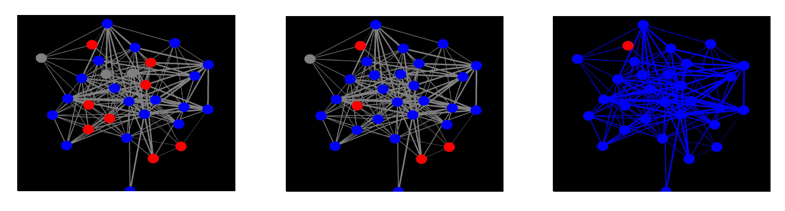
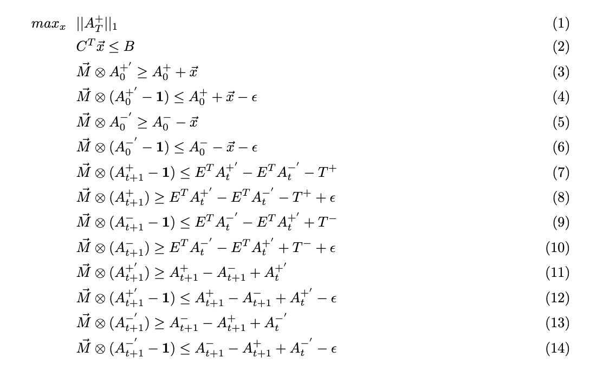

# HPV Vaccination Attitude Analysis in Kenya

## Description
This repository hosts an innovative project that analyzes household survey data from Kenya, focusing on demographics, openness to HPV vaccination, and prevailing social norms. Utilizing this data, we construct a bidirectional BA network and apply the linear threshold model with two thresholds to capture both negative and positive attitudes toward HPV vaccination.

## Features
1. **Network Construction**: Creates a graph class using `HPVnetwork.py`
2. **Simulation Analysis**: Utilizes `simulation.py` to generate network structures from the data and conducts sensitivity analyses through simulations with varying thresholds.
3. **Network Visualization**: Employs `OpenGLVisual.py` for visualizing network evolution. Currently, this supports partial data sets (30 out of 1000 nodes).
4. **Optimization Problem**: Addresses an optimization problem involving budget constraints and inhomogeneous education costs to shift household attitudes to positive. The relevant scripts are `branchandcut.py` for heuristic branch-and-cut methods and `HPV_optimization.py` for general optimization.

## Network Details
The BA network constructed in this analysis represents households' attitudes toward HPV vaccination. Each node represents a household and can have one of three states: positive, negative, or neutral. Nodes transition from neutral to positive or negative based on the thresholds and cannot revert to neutral. The network's edge weights and initialization are determined by the survey data, and the connections between nodes are generated randomly. The dynamics of the network is modeled using the linear threshold model.

## OpenGL Simulation Visualization 

## Optimization Formulation
The optimization problem is formulated to maximize the number of households with a positive attitude towards HPV vaccination within a given budget, considering the varying costs of changing attitudes based on initial stance. The formulation is as follows:

## Technology Stack
- Python
- NetworkX for network analysis
- NumPy and Pandas for data manipulation
- Matplotlib and OpenGL for visualization

## Contact Information
If you have any questions or would like to collaborate on this project, please contact the project maintainer at [suyan430@gmail.com].
